# Microsoft Cyber Range — Defender XDR, Sentinel & Identity Protection

## Overview

This project documents my build and investigation of an isolated Microsoft cloud cyber range using Azure, Microsoft Defender XDR, Microsoft Sentinel, Microsoft Entra ID, Intune and the wider Microsoft security stack.

The goal was not simply to deploy the services, but to understand **how telemetry moves between workloads and security products**, how identity and endpoint detections appear during an attack, and how a phishing-resistant authentication control changes the outcome.

The lab progressed through four main stages:

1. Build an isolated Azure environment and connect the Microsoft security stack.
2. Onboard Windows and Linux workloads into Microsoft Defender for Endpoint.
3. Generate controlled phishing and adversary-in-the-middle (AiTM) activity and investigate the resulting telemetry.
4. Introduce a phishing-resistant passkey policy and repeat the authentication flow to validate the defence.

---

## Architecture


The environment was built in a dedicated Azure resource group and separated into client and server subnets.

---

## Technologies

- Microsoft Azure
- Azure Virtual Network, subnets and Network Security Groups
- Azure Bastion
- Azure NAT Gateway
- Windows Server 2025
- Windows 11 Enterprise
- Ubuntu Server 22.04
- OWASP Juice Shop
- Microsoft Defender XDR
- Microsoft Defender for Endpoint
- Microsoft Defender for Cloud
- Microsoft Defender for Cloud Apps
- Microsoft Defender for Office 365
- Microsoft Sentinel
- Azure Log Analytics
- Microsoft Entra ID
- Entra ID Protection
- Conditional Access
- Passkeys / FIDO2
- Microsoft Intune
- Kusto Query Language (KQL)
- Evilginx in an isolated lab environment

---

## 1. Building the Azure Range

I first created the Azure landing zone for the range, including the resource group, virtual network, server and client subnets, Log Analytics workspace and Azure Bastion.

The server and client workloads did not expose public RDP or SSH management ports. Instead, Azure Bastion was used as the management path into the range.

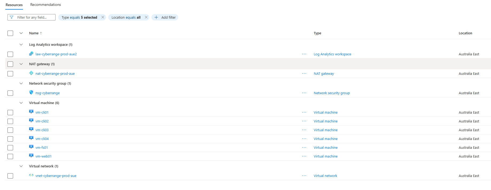

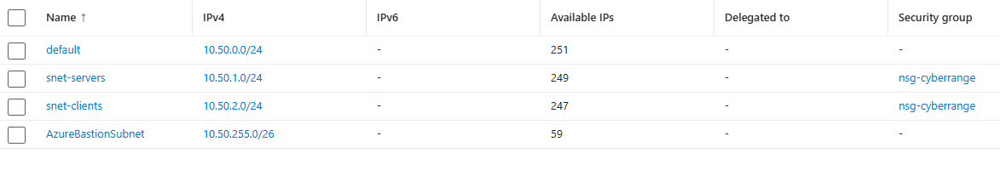

### Workloads

The range contained six main workloads:

| Workload | Purpose |
| --- | --- |
| `vm-cli01` `vm-cli02` <br> `vm-cli03` `vm-cli04`| Windows 11 client devices for user, identity and endpoint telemetry |
| `vm-fs01` | Windows file server for Windows Server and audited file activity |
| `vm-web01` | Ubuntu server running OWASP Juice Shop for Linux and web-application activity |

The Windows file server `vm-fs01` gave the range a server workload capable of producing file-access and Windows infrastructure telemetry. I enabled file-system auditing on a file share so that access activity could be observed by the security tooling.

``` sh
# Install the Windows File Server role/feature onto the server
Install-WindowsFeature FS-FileServer 

# Create a new local directory
New-Item C:\Shares\Finance -ItemType Directory

# Create a network SMB share pointing to that new directory and grant full read/write access to all users
New-SmbShare -Name Finance -Path C:\Shares\Finance -FullAccess Everyone

# Record successful access to audited file-system objects
auditpol /set /subcategory:"File System" /success:enable
```
>NOTE: All roles having full access would not typically be the case in a production environment. This is just to remove permissions complexity from the lab. In a real environment, this directory and file would be subject to least privilege, e.g.: <br>
>- Finance Users → Modify <br>
>- Finance Admins → Full Control<br>
>- Everyone → no access

The Ubuntu server `vm-web01` provided a second operating system and a deliberately vulnerable web application. A NAT Gateway was used to give the private client and server subnets outbound internet connectivity without assigning a public IP directly to the VMs. Once internet access was configured, OWASP Juice Shop was run within a Docker container on the Ubuntu server.

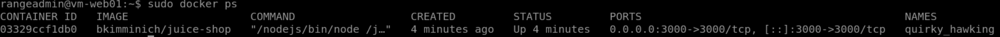

### Why include both servers?

Their purpose was to make the range a broader security environment rather than a collection of client machines.

They also demonstrated an important architectural difference: **clients were onboarded to Defender for Endpoint through Intune, while the servers were onboarded through Defender for Cloud / Defender for Servers Plan 2.**

---

## 2. Connecting the Security Stack

After deploying the Azure infrastructure, I configured the Microsoft security services that would collect and correlate telemetry from the cyber range.

The environment used several Microsoft security services, each responsible for a different type of telemetry:
- Microsoft Sentinel for SIEM investigation and correlation.
- Defender for Endpoint for endpoint telemetry. (Details in next section)
- Defender for Cloud for server protection and server onboarding. (Details in next section)
- Defender for Cloud Apps for cloud application and session telemetry.
- Defender for Office 365 for email and phishing telemetry.
- Entra ID Protection for identity risk detections.

### Microsoft Sentinel

A Microsoft Sentinel instance was created and connected to the Log Analytics Workspace. Then, the Sentinel workspace was connected to the unified Microsoft Defender portal so that SIEM and XDR investigation could take place from the same interface.

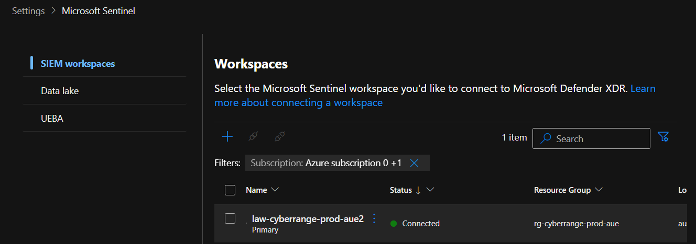

### Defender for Cloud Apps

Defender for Cloud Apps was provisioned and connected to the Microsoft 365 tenant using an App Connector. The connector provided visibility into Entra ID sign-in activity, identity and management events, Microsoft 365 activity and supported file telemetry. As a native Defender XDR workload, Cloud Apps could then contribute its detections and activity data to the unified Defender investigation experience. 

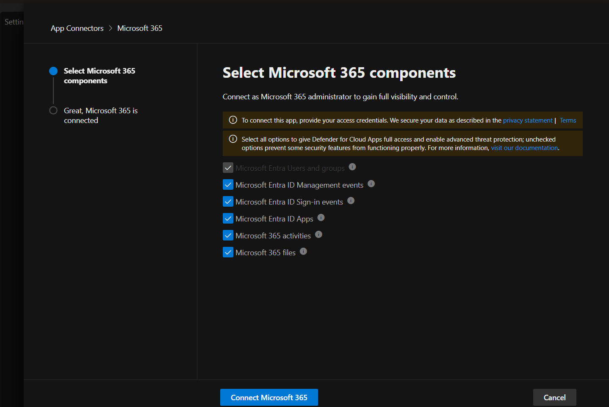

### Defender for Office 365

Microsoft Defender for Office 365 provided the email and phishing protection layer for the lab environment. I configured the standard protection policy to apply across all recipients in the tenant, giving the test users a consistent baseline for anti-phishing and email security controls.

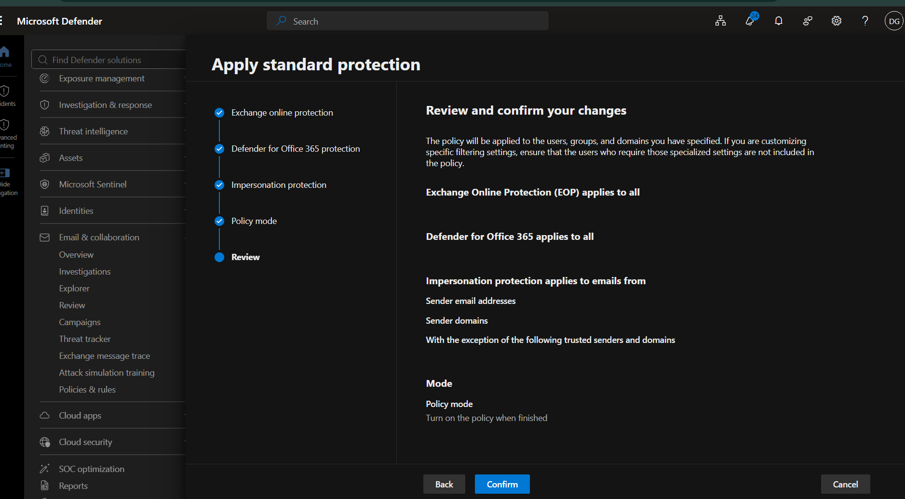

### Entra ID

Microsoft Entra ID provided the identity and access layer for the cyber range. I used it to manage lab users, join the *Windows 11 client* devices to the tenant, and configured the MDM scope so that when a licensed user joins a Windows device to Entra ID, Windows will automatically enroll that device into Intune too. 

I created two users, analyst01 and analyst02, and assigned them each a Microsoft 365 E5 license. They act as everyday users of the environment and will each enrol two of the client machines onto Intune. 

The [next section](#3-client-and-server-onboarding) will cover joining the Windows 11 clients to the Entra ID tenant in more detail.

This section was one of the most useful parts of the lab because it made the distinction between the products much clearer to me:

- **Defender XDR** correlates signals across Microsoft security workloads.
- **Sentinel** provides SIEM capabilities over data in the Log Analytics workspace.
- **Entra ID Protection** produces identity-risk detections.
- The **Defender portal** provides a unified place to investigate much of this activity.

---

## 3. Client and Server Onboarding

### Windows 11 clients

The four Windows 11 client VMs were joined to Microsoft Entra ID and automatically enrolled into Microsoft Intune through the configured MDM scope. This provided a central management path for the client devices and allowed endpoint security policies to be applied consistently across the lab environment. 

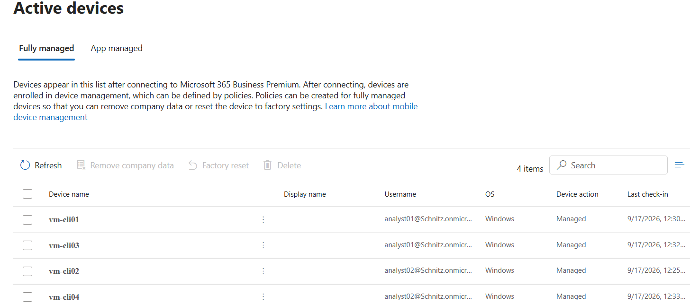

I then used an Intune Endpoint Detection and Response (EDR) policy to onboard the clients into Microsoft Defender for Endpoint. Once onboarding completed, the devices began reporting endpoint telemetry into Microsoft Defender XDR, where they could be monitored alongside the server workloads. 

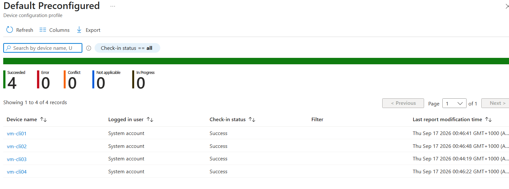

```text
Windows 11 clients
        │
        ▼
Microsoft Entra ID
        │
        ▼
Microsoft Intune
        │
        ▼
Defender for Endpoint
        │
        ▼
Microsoft Defender XDR
``` 

### Server workloads

The Windows file server and Ubuntu web server followed a separate onboarding path from the Windows 11 clients. Rather than enrolling the servers into Intune, I enabled Microsoft Defender for Servers Plan 2 through Microsoft Defender for Cloud, which automatically onboarded the supported server workloads into Microsoft Defender for Endpoint.

This allowed both the Windows and Linux servers to contribute endpoint telemetry to Microsoft Defender XDR while still being managed through the cloud-security layer provided by Defender for Cloud.

File Integrity Monitoring (FIM) was also enabled for the Log Analytics workspace to monitor changes to record file and registry changes on supported workloads, with those events stored in the same Log Analytics workspace used by Microsoft Sentinel. Separately, Defender for Cloud was configured to continuously export its security alerts and recommendations to that workspace.

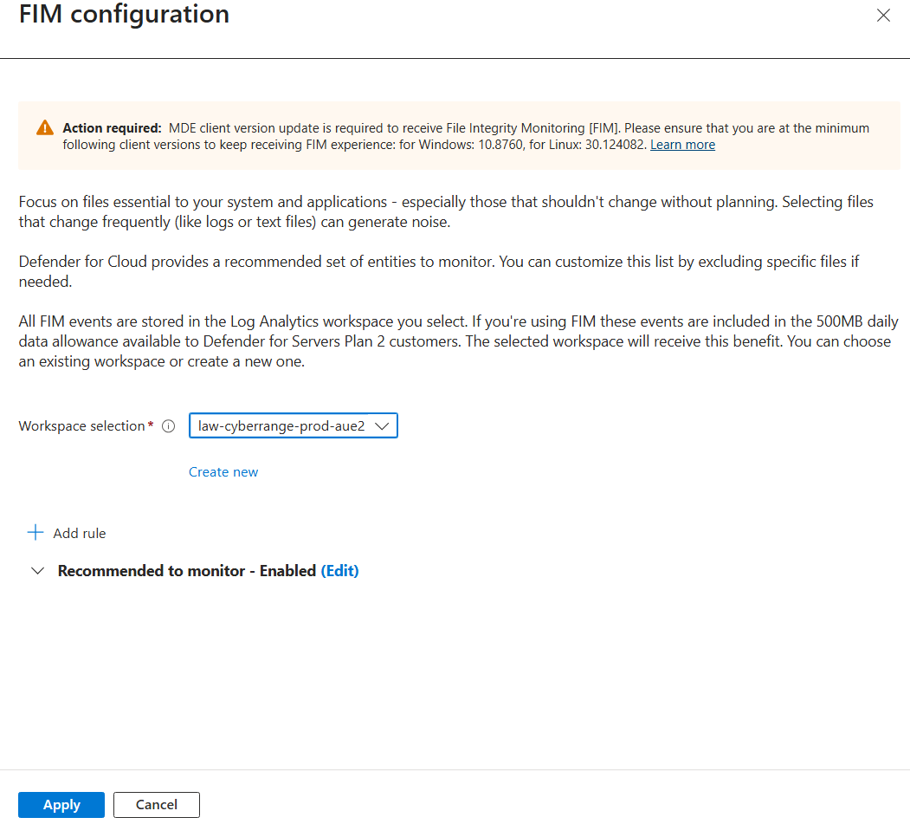
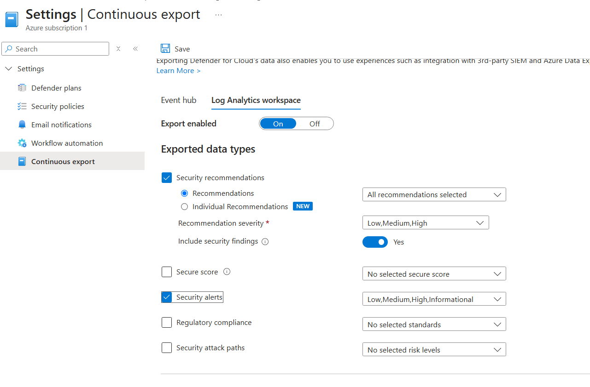

```text
Server workloads
        │
        ▼
Microsoft Defender for Cloud
(Defender for Servers Plan 2)
        │
        ▼
Defender for Endpoint
        │
        ▼
Microsoft Defender XDR
```

### Verification

After onboarding completed, **all six workloads appeared in the Defender XDR device inventory**.

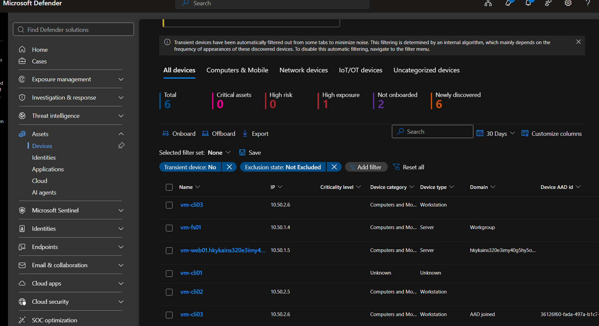

I then generated benign Defender for Endpoint detection tests to verify that the sensors were not only installed, but were actively producing security telemetry.

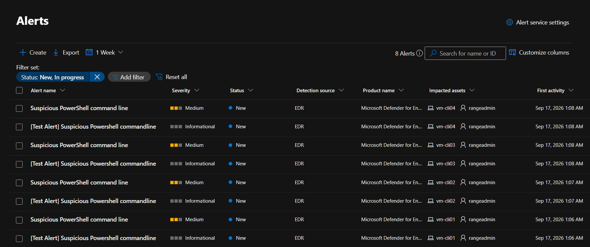

---

## 4. Phishing Simulation

Before moving to the AiTM exercise, I used Microsoft Defender for Office 365 Attack Simulation Training against a dedicated test account.

The dedicated test account ```aitm-target@schnitz.onmicrosoft.com``` has a Microsoft E5 license and is MFA enforced (important for the [AiTM identity attack](#5-aitm-identity-attack)).

This account was sent a credential harvesting email disguised as an urgent TESCO account suspension email. I pretended to not know any better and clicked the link, which took me to a spoofed TESCO login page. Once a set of fake credentials were inputted, we were met with:

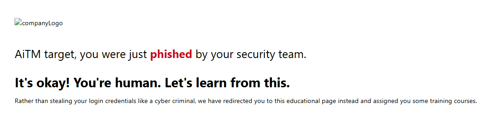

The simulation generated the email-side phishing telemetry and provided a controlled way to observe how Microsoft 365 recorded user interaction with a phishing scenario.

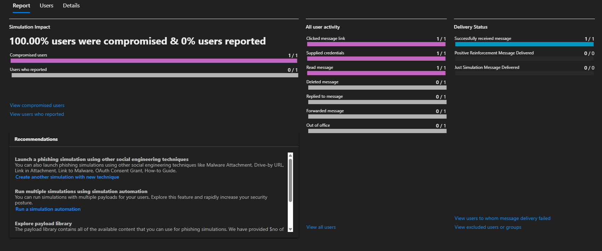

This was useful as an initial exercise, but it was different from the identity attack that followed. The simulation demonstrated phishing awareness and email telemetry, while the later AiTM test exercised live authentication and session-risk detections.

---
