# Microsoft Cyber Range — Defender XDR, Sentinel & Identity Protection

## Table of Contents
 
- [Overview](#overview)
- [Architecture](#architecture)
- [Technologies](#technologies)
- [1. Building the Azure Range](#1-building-the-azure-range)
  - [Workloads](#workloads)
  - [Why include both servers?](#why-include-both-servers)
- [2. Connecting the Security Stack](#2-connecting-the-security-stack)
  - [Microsoft Sentinel](#microsoft-sentinel)
  - [Defender for Cloud Apps](#defender-for-cloud-apps)
  - [Defender for Office 365](#defender-for-office-365)
  - [Entra ID](#entra-id)
- [3. Client and Server Onboarding](#3-client-and-server-onboarding)
  - [Windows 11 clients](#windows-11-clients)
  - [Server workloads](#server-workloads)
  - [Verification](#verification)
- [4. Phishing Simulation](#4-phishing-simulation)
- [5. AiTM Identity Attack](#5-aitm-identity-attack)
  - [Evilginx Introduction](#evilginx-introduction)
  - [Priming Evilginx](#priming-evilginx)
  - [Phishing the Victim](#phishing-the-victim)
- [6. Detection and Investigation](#6-detection-and-investigation)
  - [Entra ID Protection](#entra-id-protection)
  - [Defender XDR](#defender-xdr)
  - [Investigation Timeline](#investigation-timeline)
  - [Mock Analyst Assessment](#mock-analyst-assessment)
  - [MITRE ATT&CK Mapping](#mitre-attck-mapping)
- [7. Passkey Defence](#7-passkey-defence)
  - [Re-testing the authentication flow](#re-testing-the-authentication-flow)
- [Results](#results)
- [Skills Demonstrated](#skills-demonstrated)
- [Security and Lab Scope](#security-and-lab-scope)
- [References](#references)
---

## Overview

This project documents my build and investigation of an isolated Microsoft cloud cyber range using Azure, Microsoft Defender XDR, Microsoft Sentinel, Microsoft Entra ID, Intune and the wider Microsoft security stack.

The goal was not simply to deploy the services, but to understand **how telemetry moves between workloads and security products**, how identity and endpoint detections appear during an attack, and how a phishing-resistant authentication control changes the outcome.

The lab progressed through four main stages:

1. Build an isolated Azure environment and connect the Microsoft security stack.
2. Onboard Windows and Linux workloads into Microsoft Defender for Endpoint.
3. Generate controlled phishing and adversary-in-the-middle (AiTM) activity and investigate the resulting telemetry.
4. Introduce a phishing-resistant passkey policy and repeat the authentication flow to validate the defence.


---

## Architecture

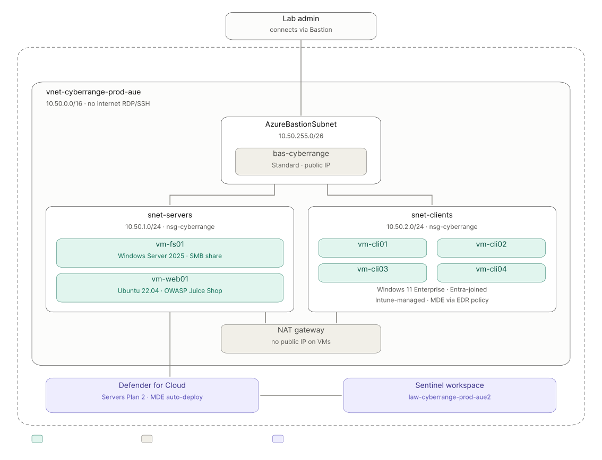
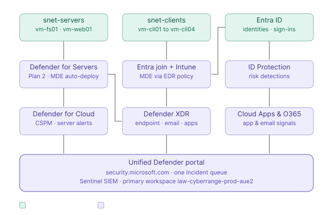

The environment was built in a dedicated Azure resource group and separated into client and server subnets.

---

## Technologies

- Microsoft Azure
- Azure Virtual Network, subnets and Network Security Groups
- Azure Bastion
- Azure NAT Gateway
- Windows Server 2025
- Windows 11 Enterprise
- Ubuntu Server 22.04
- OWASP Juice Shop
- Microsoft Defender XDR
- Microsoft Defender for Endpoint
- Microsoft Defender for Cloud
- Microsoft Defender for Cloud Apps
- Microsoft Defender for Office 365
- Microsoft Sentinel
- Azure Log Analytics
- Microsoft Entra ID
- Entra ID Protection
- Conditional Access
- Passkeys / FIDO2
- Microsoft Intune
- Kusto Query Language (KQL)
- Evilginx in an isolated lab environment

---

## 1. Building the Azure Range

I first created the Azure landing zone for the range, including the resource group, virtual network, server and client subnets, Log Analytics workspace and Azure Bastion.

The server and client workloads did not expose public RDP or SSH management ports. Instead, Azure Bastion was used as the management path into the range.


### Workloads

The range contained six main workloads:

| Workload | Purpose |
| --- | --- |
| `vm-cli01` `vm-cli02` <br> `vm-cli03` `vm-cli04`| Windows 11 client devices for user, identity and endpoint telemetry |
| `vm-fs01` | Windows file server for Windows Server and audited file activity |
| `vm-web01` | Ubuntu server running OWASP Juice Shop for Linux and web-application activity |

The Windows file server `vm-fs01` gave the range a server workload capable of producing file-access and Windows infrastructure telemetry. I enabled file-system auditing on a file share so that access activity could be observed by the security tooling.

``` sh
# Install the Windows File Server role/feature onto the server
Install-WindowsFeature FS-FileServer 

# Create a new local directory
New-Item C:\Shares\Finance -ItemType Directory

# Create a network SMB share pointing to that new directory and grant full read/write access to all users
New-SmbShare -Name Finance -Path C:\Shares\Finance -FullAccess Everyone

# Record successful access to audited file-system objects
auditpol /set /subcategory:"File System" /success:enable
```
>NOTE: All roles having full access would not typically be the case in a production environment. This is just to remove permissions complexity from the lab. In a real environment, this directory and file would be subject to least privilege, e.g.: <br>
>- Finance Users → Modify <br>
>- Finance Admins → Full Control<br>
>- Everyone → no access

The Ubuntu server `vm-web01` provided a second operating system and a deliberately vulnerable web application. A NAT Gateway was used to give the private client and server subnets outbound internet connectivity without assigning a public IP directly to the VMs. Once internet access was configured, OWASP Juice Shop was run within a Docker container on the Ubuntu server.


### Why include both servers?

Their purpose was to make the range a broader security environment rather than a collection of client machines.

They also demonstrated an important architectural difference in security tools and how they are onboarded to them.

---

## 2. Connecting the Security Stack

After deploying the Azure infrastructure, I configured the Microsoft security services that would collect and correlate telemetry from the cyber range.

The environment used several Microsoft security services, each responsible for a different type of telemetry:
- Microsoft Sentinel for SIEM investigation and correlation.
- Defender for Endpoint for endpoint telemetry. (Details in next section)
- Defender for Cloud for server protection and server onboarding. (Details in next section)
- Defender for Cloud Apps for cloud application and session telemetry.
- Defender for Office 365 for email and phishing telemetry.
- Entra ID Protection for identity risk detections.

### Microsoft Sentinel

A Microsoft Sentinel instance was created and connected to the Log Analytics Workspace. Then, the Sentinel workspace was connected to the unified Microsoft Defender portal so that SIEM and XDR investigation could take place from the same interface.


### Defender for Cloud Apps

Defender for Cloud Apps was provisioned and connected to the Microsoft 365 tenant using an App Connector. The connector provided visibility into Entra ID sign-in activity, identity and management events, Microsoft 365 activity and supported file telemetry. As a native Defender XDR workload, Cloud Apps could then contribute its detections and activity data to the unified Defender investigation experience. 


### Defender for Office 365

Microsoft Defender for Office 365 provided the email and phishing protection layer for the lab environment. I configured the standard protection policy to apply across all recipients in the tenant, giving the test users a consistent baseline for anti-phishing and email security controls.


### Entra ID

Microsoft Entra ID provided the identity and access layer for the cyber range. I used it to manage lab users, join the *Windows 11 client* devices to the tenant, and configured the MDM scope so that when a licensed user joins a Windows device to Entra ID, Windows will automatically enroll that device into Intune too. 

I created two users, analyst01 and analyst02, and assigned them each a Microsoft 365 E5 license. They act as everyday users of the environment and will each enrol two of the client machines onto Intune. 

The [next section](#3-client-and-server-onboarding) will cover joining the Windows 11 clients to the Entra ID tenant in more detail.

This section was one of the most useful parts of the lab because it made the distinction between the products much clearer to me:

- **Defender XDR** correlates signals across Microsoft security workloads.
- **Sentinel** provides SIEM capabilities over data in the Log Analytics workspace.
- **Entra ID Protection** produces identity-risk detections.
- The **Defender portal** provides a unified place to investigate much of this activity.

---

## 3. Client and Server Onboarding

### Windows 11 clients

The four Windows 11 client VMs were joined to Microsoft Entra ID and automatically enrolled into Microsoft Intune through the configured MDM scope. This provided a central management path for the client devices and allowed endpoint security policies to be applied consistently across the lab environment. 


I then used an Intune Endpoint Detection and Response (EDR) policy to onboard the clients into Microsoft Defender for Endpoint. Once onboarding completed, the devices began reporting endpoint telemetry into Microsoft Defender XDR, where they could be monitored alongside the server workloads. 


```text
Windows 11 clients
        │
        ▼
Microsoft Entra ID
        │
        ▼
Microsoft Intune
        │
        ▼
Defender for Endpoint
        │
        ▼
Microsoft Defender XDR
``` 

### Server workloads

The Windows file server and Ubuntu web server followed a separate onboarding path from the Windows 11 clients. Rather than enrolling the servers into Intune, I enabled Microsoft Defender for Servers Plan 2 through Microsoft Defender for Cloud, which automatically onboarded the supported server workloads into Microsoft Defender for Endpoint.

This allowed both the Windows and Linux servers to contribute endpoint telemetry to Microsoft Defender XDR while still being managed through the cloud-security layer provided by Defender for Cloud.

File Integrity Monitoring (FIM) was also enabled for the Log Analytics workspace to monitor changes to record file and registry changes on supported workloads, with those events stored in the same Log Analytics workspace used by Microsoft Sentinel. Separately, Defender for Cloud was configured to continuously export its security alerts and recommendations to that workspace.


```text
Server workloads
        │
        ▼
Microsoft Defender for Cloud
(Defender for Servers Plan 2)
        │
        ▼
Defender for Endpoint
        │
        ▼
Microsoft Defender XDR
```

### Verification

After onboarding completed,all six workloads appeared in the Defender XDR device inventory.


I then generated benign Defender for Endpoint detection tests to verify that the sensors were not only installed, but were actively producing security telemetry.


---

## 4. Phishing Simulation

Before moving to the AiTM exercise, I used Microsoft Defender for Office 365 Attack Simulation Training against a dedicated test account.

The dedicated test account ```aitm-target@schnitz.onmicrosoft.com``` has a Microsoft E5 license and is MFA enforced (important for the [AiTM identity attack](#5-aitm-identity-attack)).

This account was sent a credential harvesting email disguised as an urgent TESCO account suspension email. I pretended to not know any better and clicked the link, which took me to a spoofed TESCO login page. Once a set of fake credentials were inputted, we were met with:

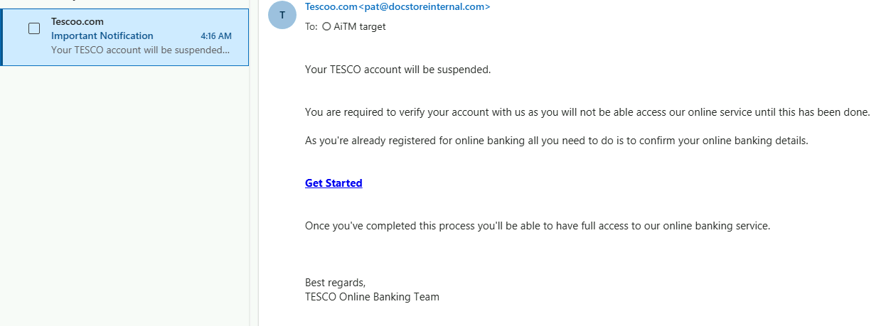


The simulation generated the email-side phishing telemetry and provided a controlled way to observe how Microsoft 365 recorded user interaction with a phishing scenario.


This was useful as an initial exercise, but it was different from the identity attack that followed. The simulation demonstrated phishing awareness and email telemetry, while the later AiTM test exercised live authentication and session-risk detections.

---

## 5. AiTM Identity Attack

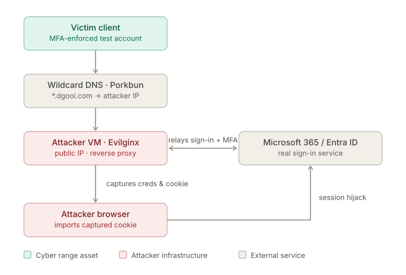

### Evilginx Introduction

Evilginx is an Adversary-in-the-Middle (AiTM) phishing framework that operates as a reverse proxy between a target user and a legitimate authentication service. Rather than presenting a completely separate fake login page, it proxies the real sign-in flow to the user.

When the user enters their credentials and completes a supported MFA challenge, the authentication is relayed to the legitimate service in real time. If authentication succeeds, the resulting authenticated session can be captured by the proxy. This demonstrates why traditional MFA can still be vulnerable to AiTM attacks, and why phishing-resistant authentication methods such as FIDO2/passkeys are important.

### Priming Evilginx

I created a separate attacker resource group and an attacker Ubuntu VM. Keeping the attacker infrastructure separate from the main cyber range helped isolate the offensive component from the normal client and server workloads.

The attacker VM was assigned a public IP address and configured to accept inbound HTTP and HTTPS traffic so that the lab domain could resolve to the Evilginx reverse proxy and the lure could be accessed from the test client. I also permitted inbound SSH access so I could remotely administer the VM and configure the Evilginx environment.

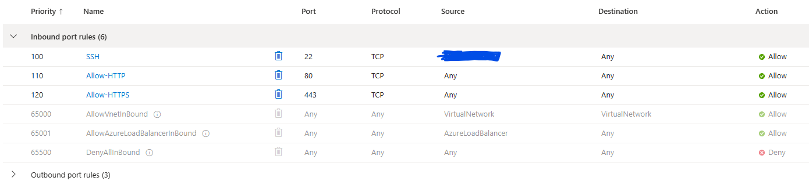

I purchased a dedicated lab domain through Porkbun and created a wildcard DNS record: `*.dgooi.com`

The wildcard record pointed matching subdomains to the public IP address of the attacker VM. This allowed the lure hostname generated by Evilginx to resolve to the reverse proxy running on that server.

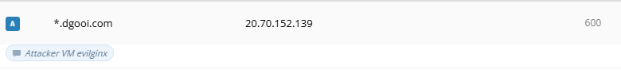

After the DNS configuration was in place, I connected to the attacker VM, installed and configured Evilginx, and generated a lure URL for the dedicated test account.

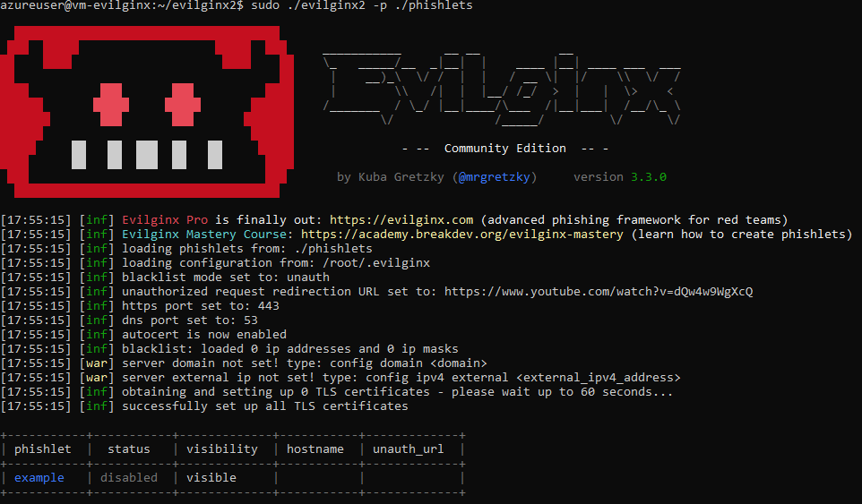
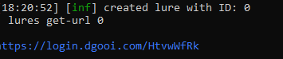

### Phishing the Victim

Roleplaying as the victim, I logged in to a client workstation as the test account `aitm-target@schnitz.onmicrosoft.com`, opened up a browser and inserted the lure URL into the URL bar. The URL brought me to a proxy of the real Microsoft login page.

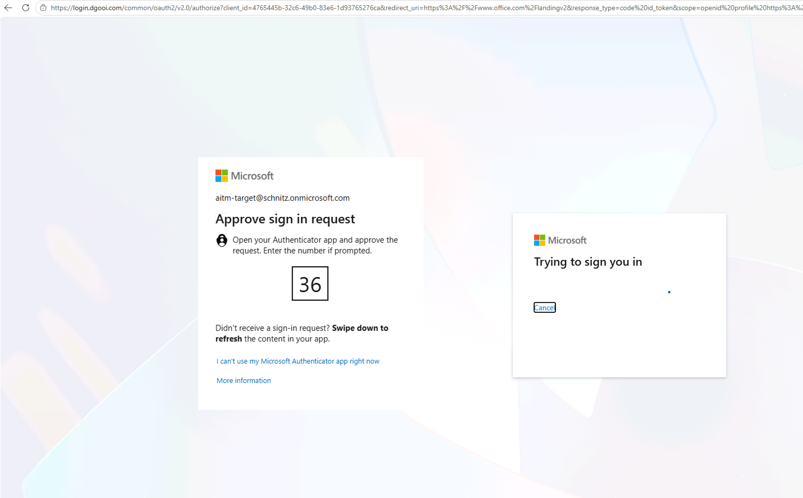

> Notice that the URL is the lure link

From there, I proceeded to login to Microsoft Office 365 using the account's credentials and complete the MFA challenge. Shotrly after, the test account is logged in successfully and seemingly securely, however on my attacker machine, Evilginx has already captured the account's login credentials and more importantly the session's authenticated cookie.

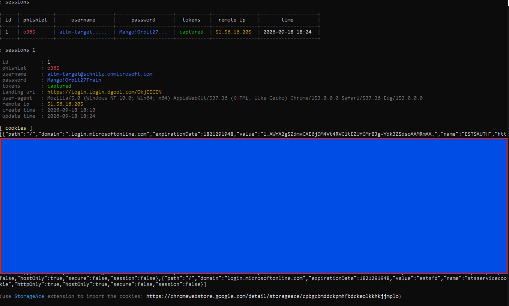

Having the authenticated session cookie harvested means that, as the attacker, I can now access the account's Office 365 apps from any device, anywhere, by importing the harvested cookie into any browser. The Microsoft server believes that the session is rightfully authenticated because of the imported session cookie, and will let me into the victim's account without the need for credentials or an additional MFA challenge.

> The purpose of this stage (stage 5) was not simply to reproduce a phishing attack, but to generate realistic identity and session telemetry that I could later investigate using Microsoft Entra ID Protection and Defender XDR. I repeatedly accessed the test account using the hijacked token to purposely generate this telemetry.

---

## 6. Detection and Investigation

Following the AiTM phishing activity, I investigated the account through Entra ID Protection, Entra sign-in logs and Defender XDR. The objective was to determine whether the suspicious session activity could be correlated across Microsoft's identity and detection telemetry and to reconstruct the sequence of events.

### Entra ID Protection

Entra ID Protection generated multiple Anomalous Token detections for the test account. Earlier detections were associated with sign-in activity originating from a Melbourne-based IPv6 address, while later suspicious activity was observed from 194.233.86.187, geolocated to Singapore (this anomalous event was generated via VPN).

The account's risk timeline ultimately showed a High user risk state through Microsoft's unified risk signals.

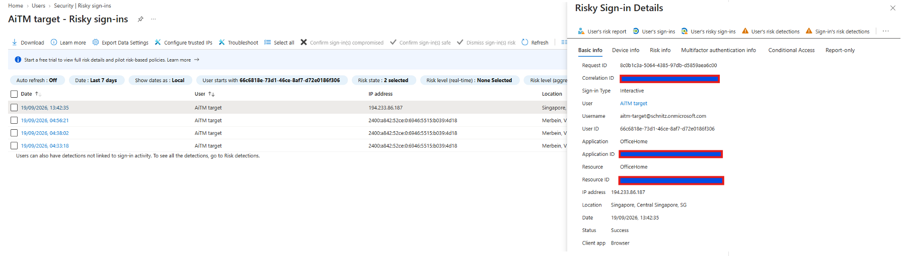

### Defender XDR

Defender XDR subsequently generated two significant alerts:

- **User compromised through session cookie hijack** — High severity
- **Anomalous Token** — Medium severity

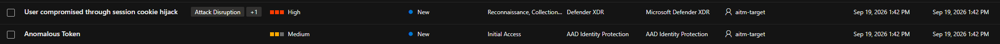
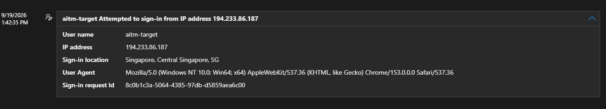

The session-cookie hijack alert reported that an active user session had been observed across environments with inconsistent network, location or user-agent attributes, indicating possible unauthorised session reuse. The related event timeline showed the test account accessing OfficeHome from 194.233.86.187, with the source geolocated to Singapore. This alert corresponded to the same sign-in previously identified by Entra ID Protection. The matching sign-in request ID, `8c0b1c3a-5064-4385-97db-d5859aea6c00`, provided a direct correlation between the Entra and Defender XDR detections, confirming that both alerts referred to the same sign-in event rather than being associated only because they involved the same account and source IP address.

### Investigation Timeline

The evidence across the portals supported the following sequence:

1. Initial authentication<br>
The test account completed the authentication process during the controlled AiTM simulation.

2. Authenticated session obtained<br>
The resulting authenticated session was captured as part of the simulated AiTM workflow.

3. Session reused from a different network context<br>
Activity associated with the account was subsequently observed from 194.233.86.187 in Singapore.

4. Identity risk detected<br>
Entra ID Protection generated Anomalous Token detections and ultimately elevated the account to a High-risk state through its unified risk signals.

5. Session hijacking alert generated<br>
Defender XDR correlated the abnormal session behaviour and generated the High-severity User compromised through session cookie hijack alert.

### Mock Analyst Assessment

| Field | Value |
| --- | --- |
| Severity | High |
| Account | `aitm-target@schnitz.onmicrosoft.com` |
 
**Initial triage**
 
Two alerts landed for the same account inside the same window: an Entra ID Protection Anomalous Token detection and a Defender XDR *User compromised through session cookie hijack* alert. Both referenced sign-in activity from 194.233.86.187 (Singapore) - a location inconsistent with the account's normal pattern - and both were tied to the same sign-in request ID. That shared identifier confirmed the two alerts described one event, not two coincidentally related ones.
 
**Working hypothesis**
 
An anomalous-token detection paired with a session-hijack alert, but with no corresponding failed or brand-new sign-in from the suspicious location, pointed toward session or token reuse rather than a fresh credential compromise. The attacker likely never needed the password again because they were reusing an already-authenticated session.
 
**Advanced Hunting: testing the hypothesis**
 
An alert confirms that a detection fired; it doesn't confirm scope. To test the session-reuse hypothesis directly, I queried Entra sign-in telemetry in Advanced Hunting for sessions tied to more than one source IP:
 
```kusto
EntraIdSignInEvents
| where Timestamp > ago(7d)
| where AccountUpn =~ "aitm-target@Schnitz.onmicrosoft.com"
| where isnotempty(SessionId)
| summarize
    IPs = make_set(IPAddress),
    Countries = make_set(Country),
    Apps = make_set(Application),
    SignInCount = count()
    by SessionId
| where array_length(IPs) > 1
```
 
If the account had simply been compromised again with valid credentials, this query would return nothing interesting. A new sign-in creates a new session ID. Instead, it returned a single session ID spread across multiple IP addresses and countries, which is the signature of a stolen session being replayed rather than a fresh authentication.
 
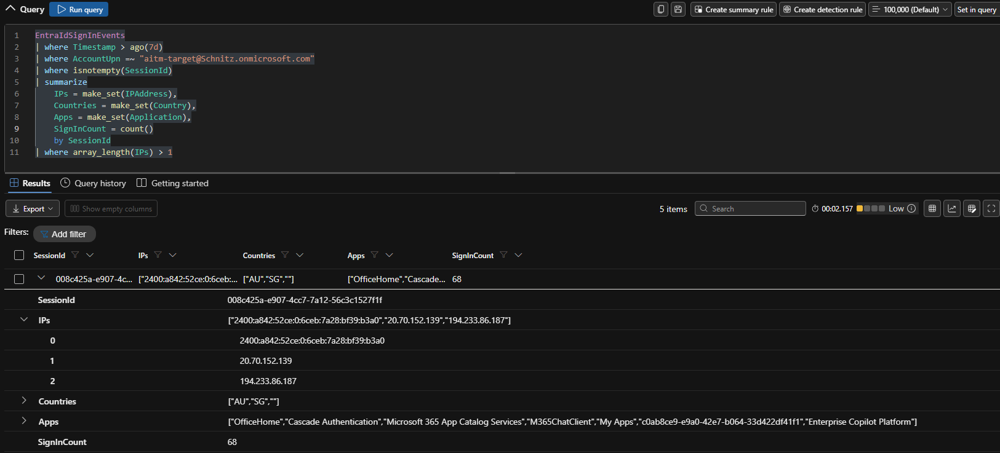
 
> The same session ID appearing across multiple IP addresses is consistent with the controlled session-replay activity performed earlier in the lab, and rules out an independent, credential-based compromise for this specific event.
 
**Conclusion**
 
The shared sign-in request ID, the anomalous-token detections, the session-cookie hijack alert, and the multi-IP session confirmed through hunting all point the same way: authenticated session reuse following the AiTM attack, not a standalone credential compromise.
 
Because this was a controlled lab, the real method (Evilginx cookie theft) was already known going in. In a genuine investigation, this evidence would support the session-hijack conclusion but wouldn't by itself prove *how* the session was obtained. Endpoint telemetry, browser/device detail and the original authentication event would still need reviewing to close out the full attack chain.
 
**Recommended action:** revoke the account's active sessions and refresh tokens, reset its credentials, and reassess whether its current authentication method allows session material to be phished at all, which is exactly what the next stage of this project tests.

### MITRE ATT&CK Mapping
 
| Tactic | Technique | What Happened in the Lab | Detected By |
| --- | --- | --- | --- |
| Initial Access | [Phishing: Spearphishing Link (T1566.002)](https://attack.mitre.org/techniques/T1566/002/) | The credential-harvesting email (Section 4) and the Evilginx lure URL (Section 5) were both delivered as a link to the test account. | Defender for Office 365 Attack Simulation report |
| Credential Access | [Adversary-in-the-Middle (T1557)](https://attack.mitre.org/techniques/T1557/) | Evilginx sat as a reverse proxy between the client and the real Microsoft sign-in page, relaying the authentication flow in both directions. | Not directly observable. This happens on attacker-controlled infrastructure outside the monitored tenant |
| Credential Access | [Steal Web Session Cookie (T1539)](https://attack.mitre.org/techniques/T1539/) | Evilginx captured the account's credentials and its authenticated session cookie once MFA completed. | Not directly observable - same limitation as above |
| Defense Evasion, Lateral Movement | [Use Alternate Authentication Material: Web Session Cookie (T1550.004)](https://attack.mitre.org/techniques/T1550/004/) | The captured cookie was imported into a separate browser and reused to access Microsoft 365 as the victim, without a password or a new MFA prompt. | Entra ID Protection - Anomalous Token; Defender XDR - User compromised through session cookie hijack |
| Initial Access, Persistence, Privilege Escalation, Defense Evasion | [Valid Accounts: Cloud Accounts (T1078.004)](https://attack.mitre.org/techniques/T1078/004/) | Every step - the original sign-in and the later hijacked access - used the same licensed cloud identity, `aitm-target@schnitz.onmicrosoft.com`. | Entra sign-in logs; Advanced Hunting session-ID correlation |
 
The gap in the "Detected By" column for T1557 and T1539 is itself a useful finding: the reverse-proxy and cookie-theft steps happen entirely on infrastructure the defender doesn't control, so they generate no telemetry in the tenant. Everything that *was* detected came from the account's identity being reused afterwards (T1550.004) - which is exactly why session-based defences and phishing-resistant MFA are equally as important as detecting the phishing attempt itself.

---

## 7. Passkey Defence

The final stage of the project was to move from **detecting** the attack to **preventing** the authentication flow from succeeding.

I enabled passkey/FIDO2 authentication for the lab account and configured a Conditional Access policy requiring a **phishing-resistant authentication strength**.

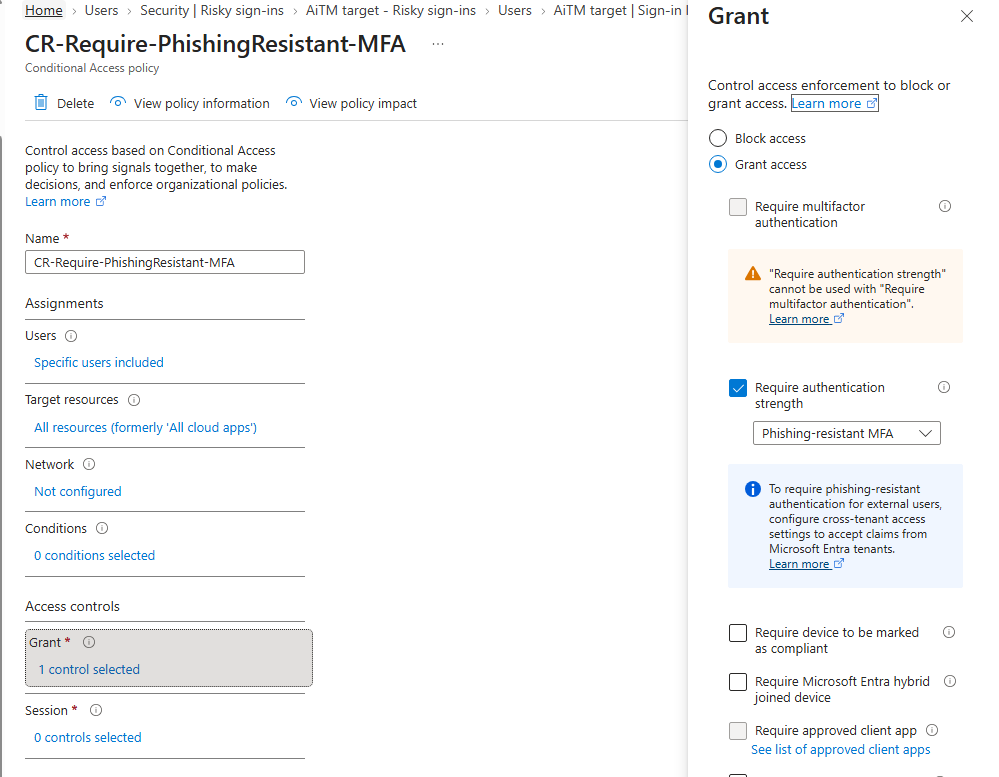

### Re-testing the authentication flow

I then repeated the sign-in attempt.

The resulting authentication details were the strongest validation of the defence:

- The password stage was accepted.
- The session then reached the stronger MFA requirement.
- Authentication did **not** satisfy the required phishing-resistant authentication strength.
- The sign-in required the registered passkey/security key instead.
- The Policy Impact page showed that policy controls were not met, meaning that the Conditional Access policy was not satisfied.

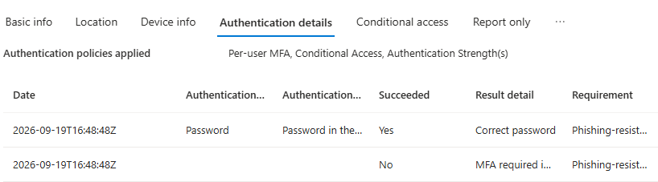
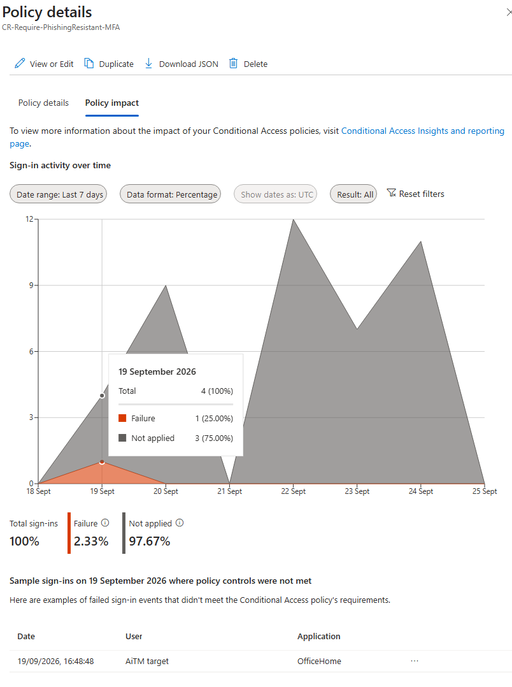

This result was important because it demonstrated the difference between ordinary MFA and phishing-resistant authentication.

The defence did not depend on recognising a stolen session after the fact. Instead, the authentication flow itself required a credential that could not simply be relayed through the AiTM proxy.

---

## Results

| Validation | Result |
| --- | --- |
| Azure client/server estate deployed | 6 workloads |
| Windows clients Entra joined and Intune managed | Successful |
| Clients onboarded to Defender for Endpoint | Successful |
| Servers onboarded through Defender for Cloud | Successful |
| All workloads visible in Defender XDR | Successful |
| Endpoint detection tests generated alerts | Successful |
| Phishing simulation telemetry generated | Successful |
| Identity/session-risk activity detected | Successful |
| Defender XDR surfaced session-related alerts | Successful |
| Advanced Hunting used to investigate session activity | Successful |
| Phishing-resistant passkey policy applied | Successful |
| Re-test failed to satisfy phishing-resistant MFA | Successful |

---

## Skills Demonstrated

- Microsoft Azure administration
- Azure networking and workload segmentation
- Azure Bastion and private workload management
- Microsoft Defender XDR
- Microsoft Defender for Endpoint
- Microsoft Defender for Cloud
- Microsoft Sentinel
- Microsoft Entra ID and Identity Protection
- Microsoft Intune
- Conditional Access
- Passkeys / phishing-resistant MFA
- KQL and Advanced Hunting
- Endpoint telemetry validation
- Identity and session investigation
- SIEM/XDR correlation
- Security architecture documentation
- Controlled purple-team lab testing

---

## Security and Lab Scope

This project was performed entirely in an isolated lab tenant using dedicated test accounts and workloads.

The deliberately vulnerable application, phishing simulation and AiTM activity were created only for authorised testing within the cyber range. No production accounts or third-party systems were targeted.

Sensitive values such as passwords, authentication cookies, tenant identifiers, subscription identifiers and unnecessary public IP addresses are intentionally omitted from this repository.

---

## References

This project was based on and adapted from the **Mad Hat Cyber Range — Build & Detect Runbook**:

- [Mad Hat Cyber Range Guide](https://madhat.io/pages/cyber-range-guide)

Additional product behaviour was validated using Microsoft documentation for:

- Microsoft Defender XDR
- Microsoft Sentinel
- Microsoft Defender for Endpoint
- Microsoft Defender for Cloud
- Microsoft Entra ID Protection
- Microsoft Intune
- Conditional Access and authentication strengths
- Passkeys / FIDO2

The implementation, troubleshooting, screenshots, investigation and analysis in this repository reflect my own execution of the lab.
